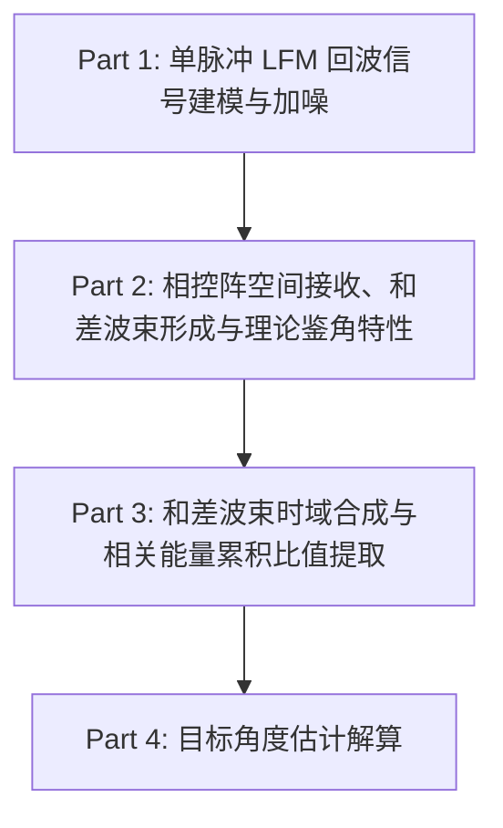

<!--more-->

## 数学公式

行内公式 $a+b=c$

行间公式
$$
a^2 + b^2 = c^2
$$

## 字体

英文示例: Best wishes for you!

中文示例: 落霞与孤鹜齐飞，秋水共长天一色。

## mermaid 流程图



## 代码块

单行代码样式：`composer require --dev barryvdh/laravel-ide-helper`

大段代码块样式：

```css
body {
  font-size: 16px;  /* comment */
}
```

```html
<a href="/about.html">Example</a>  <!-- comment -->
```

```go-html-template
{{ with $.Page.Params.content }}
  {{ . | $.Page.RenderString }}  {{/* comment */}}
{{ end }}
```

```javascript
if ([1,"one",2,"two"].includes(value)){
  console.log("Number is either 1 or 2.");  // comment
}
```

```toml
[params]
bool = true  # comment
string = 'foo'
```

## 盘古之白

你好, 我的英文名字是Zhanghua, 今年18岁.
