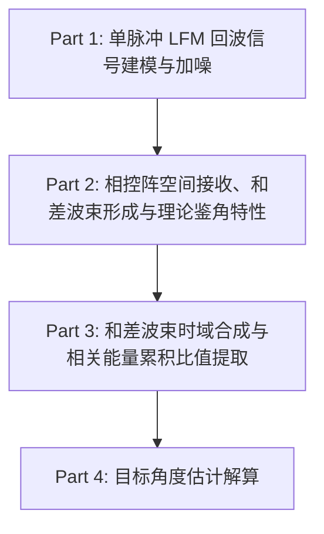
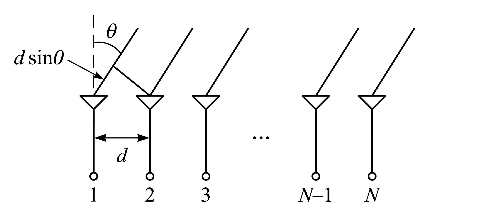

#---
title: 卡相控阵雷达单脉冲测角仿真与算法实现全流程
math: true
categories: 知识学习
---

<!--more--> 

---

## 总体系统链路流程

---

## Part 1: 单脉冲 LFM 回波信号建模与加噪

发射信号采用线性调频（LFM）脉冲，调频率为：
$$K = \frac{B}{T}$$

经距离为 $R_0$、径向速度为 $v_0$、雷达散射截面积为 $\sigma$ 的点目标反射后，目标双程时延 $\tau$ 与多普勒频移 $f_d$ 分别为：
$$\tau = \frac{2 R_0}{c}$$
$$f_d = \frac{2 v_0 f_c}{c}$$

目标纯净回波信号可表示为：
$$s_{\text{clean}}(t) = \sqrt{\sigma} \exp\left(-j 2\pi f_c \tau\right) \exp\left(j\left(2\pi (f_c + f_d) t + \pi K t^2\right)\right)$$

设定信噪比为 $\text{SNR}_{\text{dB}}$，对应复高斯白噪声功率 $P_n$ 为：
$$P_n = \frac{P_s}{10^{\text{SNR}_{\text{dB}} / 10}}, \quad P_s = \frac{1}{N_{\\text{samp}}} \sum_{n=1}^{N_{\text{samp}}} |s_{\text{clean}}[n]|^2$$

合成通道含噪单脉冲回波信号：
$$s_{\text{noisy}}(t) = s_{\text{clean}}(t) + n(t), \quad n(t) \sim \mathcal{CN}(0, P_n)$$

---

## Part 2: 相控阵空间接收、和差波束形成与理论鉴角特性

本部分涵盖阵列流型构建、多通道回波模拟、左右子阵和差波束加权合成以及理论和差鉴角响应推导。

### 2.1 阵列接收波程差示意图

如图所示，$N$ 阵元线阵中，阵元间距为 $d$，相邻阵元之间的波程差为 $d \sin\theta$，引起的空间相位差为 $\Delta \varphi = \frac{2\pi}{\lambda} d \sin\theta$。以阵列中心为界，前 $\frac{N}{2}$ 个阵元（$1 \sim \frac{N}{2}$）划分为左子阵，后 $\frac{N}{2}$ 个阵元（$\frac{N}{2}+1 \sim N$）划分为右子阵。

### 2.2 均匀线阵模型与空间导向矢量推导

考虑 $N$ 阵元均匀线阵（Uniform Linear Array, ULA），阵元编号从 $n = 1$ 到 $N$。阵元间距设为 $d$（通常设为半波长 $d = \frac{\lambda}{2}$，其中波长 $\lambda = \frac{c}{f_c}$）。

以线阵第一个阵元为基准阵元（Phase Reference Element, 空间位置 $x_1 = 0$），各阵元空间物理坐标为：
$$x_n = (n - 1) d, \quad n = 1, 2, \dots, N$$

#### 补充：空间传播延迟与相位滞后的数学推导
设发射窄带载波信号为 $s(t) = \exp(j 2\pi f_c t)$。当目标平面波以空间方位角 $\theta$ 入射时，由于阵元空间排布，第 $n$ 个阵元相对于第 $1$ 个基准阵元产生几何波程差 $\Delta R_n$ 与时间延迟 $\tau_n$：
$$\Delta R_n = x_n \sin\theta = (n - 1) d \sin\theta$$
$$\tau_n = \frac{\Delta R_n}{c} = \frac{x_n \sin\theta}{c}$$

则第 $n$ 阵元接收到的回波信号为基准阵元信号的时间延迟版本 $s(t - \tau_n)$：
$$s_n(t) = s(t - \tau_n) = \exp\big(j 2\pi f_c (t - \tau_n)\big) = \exp(j 2\pi f_c t) \cdot \exp(-j 2\pi f_c \tau_n)$$

将时延 $\tau_n = \frac{x_n \sin\theta}{c}$ 与载波波长关系 $\lambda = \frac{c}{f_c}$ 代入第二项，得到由空间几何延迟引起的相位因子：
$$\exp(-j 2\pi f_c \tau_n) = \exp\left(-j 2\pi f_c \frac{x_n \sin\theta}{c}\right) = \exp\left(-j \frac{2\pi}{\lambda} x_n \sin\theta\right)$$

定义基准阵元的相位为 $0$，则第 $n$ 阵元相对于基准阵元的空间相位滞后量 $\phi_n$ 为：
$$\phi_n = -2\pi f_c \tau_n = -\frac{2\pi}{\lambda} x_n \sin\theta$$

由此构成的阵列空间导向矢量（Steering Vector）为：
$$\mathbf{a}(\theta) = \left[ \exp\left(-j \frac{2\pi}{\lambda} x_1 \sin\theta\right), \exp\left(-j \frac{2\pi}{\lambda} x_2 \sin\theta\right), \dots, \exp\left(-j \frac{2\pi}{\lambda} x_N \sin\theta\right) \right]^T \in \mathbb{C}^{N \times 1}$$

若以阵列中心为参考坐标原点，阵元坐标对称表示为 $x_n' = \left(n - \frac{N + 1}{2}\right) d$：
* **左半部分阵元**（$n = 1, \dots, \frac{N}{2}$）：坐标 $x_n' < 0$；
* **右半部分阵元**（$n = \frac{N}{2} + 1, \dots, N$）：坐标 $x_n' > 0$。

此时导向矢量各阵元相位同样带负号，即 $\exp\left(-j \frac{2\pi}{\lambda} x_n' \sin\theta\right)$，两种坐标定义仅相差一个不影响通道比值的公共复常数相位因数。

各阵元处的接收信号矩阵 $\mathbf{X}(t) \in \mathbb{C}^{N \times N_{\text{samp}}}$ 为目标空间导向矢量与基元时域信号的外积加上通道独立高斯白噪声：
$$\mathbf{X}(t) = \mathbf{a}(\theta_{\text{true}}) \cdot s_{\text{clean}}(t) + \mathbf{N}_{\text{array}}(t)$$

### 2.3 子阵划分子空间与和差波束加权

比相型单脉冲将全阵对称划分为两个半阵：
* **左子阵（Sub-array 1）**：包含前半部分阵元（$n = 1, \dots, \frac{N}{2}$），等效相位中心位于 $x_{\text{sub1}}' = -\frac{N}{4} d$；
* **右子阵（Sub-array 2）**：包含后半部分阵元（$n = \frac{N}{2} + 1, \dots, N$），等效相位中心位于 $x_{\text{sub2}}' = +\frac{N}{4} d$。

两子阵等效相位中心间距记为 $D$：
$$D = x_{\text{sub2}}' - x_{\text{sub1}}' = \frac{N}{2} d$$

**和通道（$\Sigma$ 通道）**与**差通道（$\Delta$ 通道）**加权矢量定义为（左子阵减右子阵）：
$$\mathbf{w}_{\Sigma} = \mathbf{w}_1 + \mathbf{w}_2 = [1, 1, \dots, 1]^T$$
$$\mathbf{w}_{\Delta} = \mathbf{w}_1 - \mathbf{w}_2 = [\underbrace{1, \dots, 1}_{N/2}, \underbrace{-1, \dots, -1}_{N/2}]^T$$

在任意空间角 $\theta$ 下，阵列的和差空间响应函数（方向图因子）为：
$$F_{\Sigma}(\theta) = \mathbf{w}_{\Sigma}^T \mathbf{a}(\theta) = \sum_{n=1}^{N} \exp\left(-j \frac{2\pi}{\lambda} x_n \sin\theta\right)$$
$$F_{\Delta}(\theta) = \mathbf{w}_{\Delta}^T \mathbf{a}(\theta) = \sum_{n=1}^{N/2} \exp\left(-j \frac{2\pi}{\lambda} x_n \sin\theta\right) - \sum_{n=N/2+1}^{N} \exp\left(-j \frac{2\pi}{\lambda} x_n \sin\theta\right)$$

* $F_{\Sigma}(\theta)$ 在法线方向 $\theta = 0$ 处形成对称主瓣极大值（和波束）；
* $F_{\Delta}(\theta)$ 在法线方向 $\theta = 0$ 处形成深零陷（Null），且两侧相位反相（差波束）。

### 2.4 理论差和比推导（含白噪声分析）

两子阵等效相位中心间距为 $D$，目标以入射角 $\theta > 0$ 入射时，由于传播延迟，右子阵相对左子阵产生空间相位滞后：
$$\Delta \Phi = -\frac{2\pi}{\lambda} D \sin\theta$$

在时域中，考虑目标基元回波 $s_{\text{clean}}(t)$ 与加性复高斯白噪声，两子阵接收到的时域输出信号 $S_1(t)$ 与 $S_2(t)$ 可表示为（以对称中心为相位基准）：
$$S_1(t) = A s_{\text{clean}}(t) \exp\left(+j \frac{2\pi D}{2\lambda}\sin\theta\right) + n_1(t) = A s_{\text{clean}}(t) \exp\left(-j \frac{\Delta \Phi}{2}\right) + n_1(t)$$
$$S_2(t) = A s_{\text{clean}}(t) \exp\left(-j \frac{2\pi D}{2\lambda}\sin\theta\right) + n_2(t) = A s_{\text{clean}}(t) \exp\left(+j \frac{\Delta \Phi}{2}\right) + n_2(t)$$

其中 $A = \frac{N}{2}$ 为子阵相干积累增益系数，$n_1(t) = \mathbf{w}_1^T \mathbf{N}_{\text{array}}(t)$ 与 $n_2(t) = \mathbf{w}_2^T \mathbf{N}_{\text{array}}(t)$ 分别为左右子阵合成后的复高斯白噪声。由于两子阵阵元空间物理隔离、互不重叠，且各阵元噪声独立同分布（方差为 $\sigma_n^2$），故 $n_1(t)$ 与 $n_2(t)$ 相互统计独立，其方差均为 $\frac{N}{2} \sigma_n^2$。

由时域输出形成和通道信号 $\Sigma(t)$ 与差通道信号 $\Delta(t)$：
$$\Sigma(t) = S_1(t) + S_2(t) = 2 A s_{\text{clean}}(t) \cos\left(\frac{\pi D}{\lambda} \sin\theta\right) + n_{\Sigma}(t)$$
$$\Delta(t) = S_1(t) - S_2(t) = 2j A s_{\text{clean}}(t) \sin\left(\frac{\pi D}{\lambda} \sin\theta\right) + n_{\Delta}(t)$$

其中和、差通道噪声分量分别为：
$$n_{\Sigma}(t) = n_1(t) + n_2(t)$$
$$n_{\Delta}(t) = n_1(t) - n_2(t)$$

两通道噪声方差均为 $N \sigma_n^2$，且由于对称求和与求差，二者互协方差满足 $\mathbb{E}[n_{\Sigma}(t) n_{\Delta}^*(t)] = \mathbb{E}[|n_1|^2] - \mathbb{E}[|n_2|^2] = 0$，即 **和、差通道噪声统计正交不相关**。

在信噪比较高或通过能量积分压制噪声后（$\mathbb{E}[n_{\Sigma}] = 0, \mathbb{E}[n_{\Delta}] = 0$），理论差和比的主导确定性分量为：
$$\left. \frac{\Delta(t)}{\Sigma(t)} \right|_{\text{signal}} = \frac{2j A \sin\left(\frac{\pi D}{\lambda} \sin\theta\right)}{2 A \cos\left(\frac{\pi D}{\lambda} \sin\theta\right)} = j \tan\left(\frac{\pi D}{\lambda} \sin\theta\right)$$

因此，理论鉴角比特性（差和比的虚部 $\Im\{\Delta / \Sigma\}$）为：
$$\mathcal{D}(\theta) = \Im\left\{\left. \frac{\Delta(t)}{\Sigma(t)} \right|_{\text{signal}}\right\} = \tan\left(\frac{\pi D}{\lambda} \sin\theta\right)$$

线阵主瓣第一零陷角与 $3\text{ dB}$ 半功率波束宽度为：
$$\theta_{\text{null}} \approx \arcsin\left(\frac{\lambda}{N d}\right) = \arcsin\left(\frac{2}{N}\right)$$
$$\theta_{3\text{dB}} \approx 0.886 \frac{\lambda}{N d} = \frac{1.772}{N}$$

在法线轴中心线性区（$|\theta| \le 0.2 \theta_{3\text{dB}}$）内，$\sin\theta \approx \theta$ 且 $\tan x \approx x$，鉴角特性呈线性关系：
$$\mathcal{D}(\theta) \approx k_m \theta$$

其中单脉冲鉴角斜率 $k_m$（单位 $\text{rad}^{-1}$）为正值：
$$k_m = \left.\frac{d \mathcal{D}(\theta)}{d\theta}\right|_{\theta=0} = \frac{\pi D}{\lambda} = \frac{\pi N d}{2 \lambda}$$

---

## Part 3: 和差波束时域合成与相关能量累积比值提取

将多通道阵列接收数据 $\mathbf{X}_{\text{noisy}}(t)$ 经和、差加权矢量合成，输出和通道与差通道快时间序列：
$$\Sigma(t) = \mathbf{w}_{\Sigma}^H \mathbf{X}_{\text{noisy}}(t)$$
$$\Delta(t) = \mathbf{w}_{\Delta}^H \mathbf{X}_{\text{noisy}}(t)$$

在低信噪比或存在通道噪声时，逐点除法 $\frac{\Delta(t)}{\Sigma(t)}$ 会在脉冲边缘或包络谷底处产生剧烈的噪声放大。为此采用 **匹配能量加权互相关累积（Matched Energy Weighting）**：
$$\mu = \frac{\int \Delta(t) \Sigma^*(t) \, dt}{\int |\Sigma(t)|^2 \, dt} \approx \frac{\sum_{k=1}^{N_{\text{samp}}} \Delta[k] \Sigma^*[k]}{\sum_{k=1}^{N_{\text{samp}}} |\Sigma[k]|^2}$$

提取互相关比值的虚部作为单脉冲鉴角测量值：
$$\varepsilon = \Im\{\mu\} = \Im\left\{ \frac{\sum_{k=1}^{N_{\text{samp}}} \Delta[k] \Sigma^*[k]}{\sum_{k=1}^{N_{\text{samp}}} |\Sigma[k]|^2} \right\}$$

该方法利用和通道作为相干参考，对差通道实施相关滤波与能量加权积分，最大程度滤除不相关噪声，获得最优估计统计特性。

---

## Part 4: 目标角度估计解算

本部分作为独立的解算环节，将获取的测量鉴角比 $\varepsilon$ 反演为空间方位角。根据测量得到的鉴角比 $\varepsilon$，可采用以下两种测角解算准则：

### 4.1 线性鉴角法（Linear Approximation）

适用于目标偏离阵列法线角较小（$|\theta| \le 0.5 \theta_{3\text{dB}}$）的场景：
$$\hat{\theta}_{\text{linear}} = \frac{\varepsilon}{k_m}$$

* **优点**：计算仅涉及一次标量除法，计算复杂度极低；
* **局限**：偏角变大时，正切函数 $\tan(\cdot)$ 产生明显非线性弯曲，会引入固有的模型截断误差。

### 4.2 鉴角曲线插值反演法（Interpolation / Look-up Table）

在主瓣第一零陷内部单调区间（$|\theta| \le 0.85 \theta_{\text{null}}$）内建立理论鉴角函数映射 $\mathcal{D}(\theta)$，通过反函数插值或查表求逆解算：
$$\hat{\theta}_{\text{interp}} = \mathcal{D}^{-1}(\varepsilon) = \text{interp1}\left(\mathcal{D}_{\text{theoretical}}(\theta), \theta, \varepsilon\right)$$

* **优点**：严格校正了正切非线性失真，在整个主瓣有效视场范围内均能保持高测角精度。
